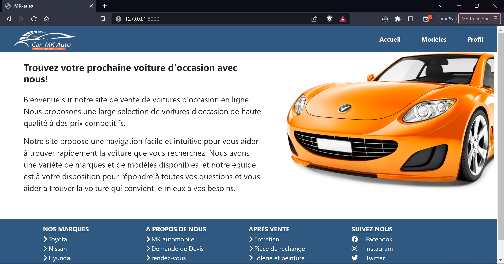
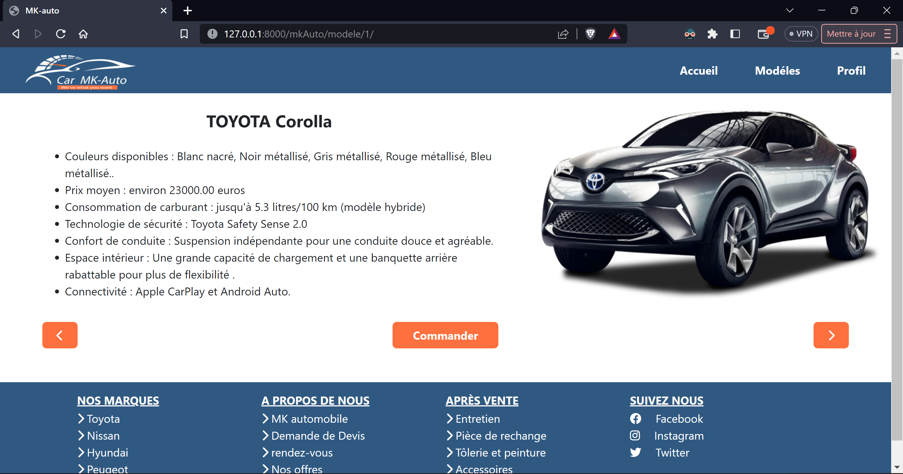
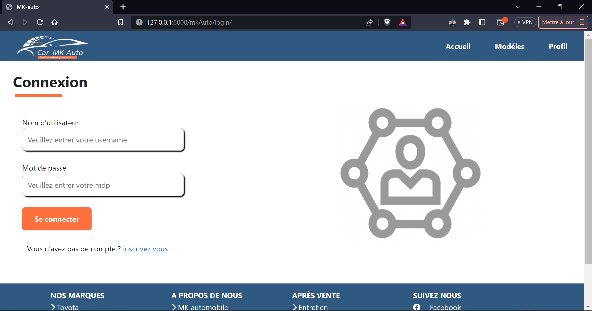

# mkAuto
Bienvenue sur le projet "Car mkAuto" développé dans le cadre d'un cours sur Django à l'École Polytechnique de Thiès.

## Présentation

Ce projet est un exemplaire fonctionnel d'un site de vente de voitures, créé pour démontrer les concepts et les compétences appris dans le cadre de notre cours de développement web avec Django. L'objectif principal de ce projet est de mettre en pratique les connaissances acquises en matière de création de sites web dynamiques et interactifs.

## Fonctionnalités

- **Intéraction avec la Base de Données:** Interagissez avec une base de données pour récupérer et stocker des informations sur les voitures et les utilisateurs du site.

- **Enregistrement d'un Nouvel Utilisateur** Les visiteurs peuvent s'inscrire sur le site en fournissant leurs informations personnelles et en créant un compte.
  
- **Affichage des Informations d'un Utilisateur:** Une fois connectés, les utilisateurs peuvent consulter leurs informations personnelles.

- **Détails du Produit:** Consultation des informations détaillées sur chaque voiture, y compris des images, des spécifications techniques et des descriptions.

## Captures d'écran








  
## Comment Tester Localement

1. Clonez ce dépôt sur votre machine :

   ```
   git clone https://github.com/MrCorazon01/mkAuto.git
   ```

2. Accédez au répertoire du projet :

   ```
   cd mkAuto
   ```

3. Installez les dépendances(si nécessaire)

4. Effectuez les migrations de la base de données :

   ```
   python manage.py migrate
   ```

5. Lancez le serveur de développement :

   ```
   python manage.py runserver
   ```

6. Accédez à l'application dans votre navigateur :

   [http://127.0.0.1:8000/](http://127.0.0.1:8000/)

---

*Ce projet a été développé dans le cadre d'un cours sur Django à l'École Polytechnique de Thiès. Il sert d'exemple pour illustrer les concepts abordés pendant le cours.*

[Mouhamadou Mansour Kholle]
